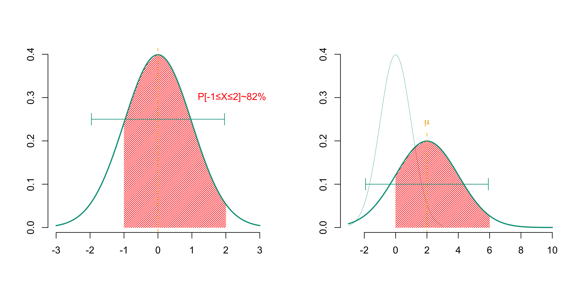
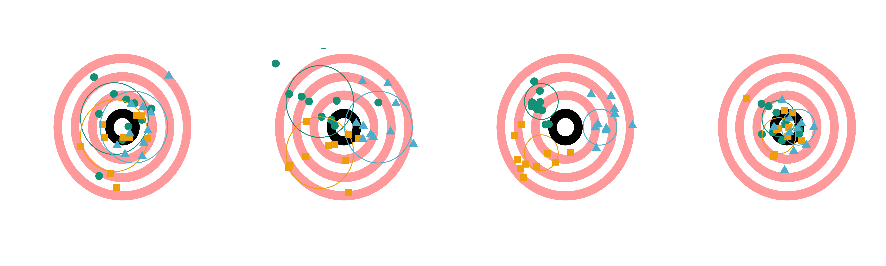
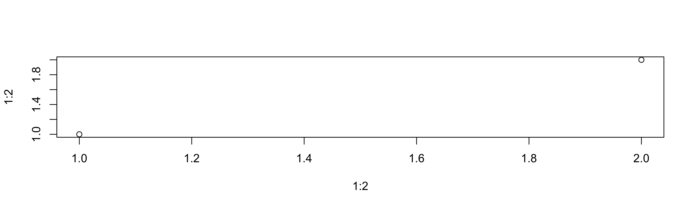

MANDASS
================
Arthur Charpentier
2022

``` r
library(splines)
library(wesanderson)
library(scales)
library(CASdatasets)
data(freMTPL2freq)
colr = wes_palette("Darjeeling1")
```

# Figure 1

``` r
par(mfrow=1:2)
vu=seq(-3,3,length=2501)
plot(vu,dnorm(vu),col="white",xlab="",ylab="",axes=FALSE)
idx=which((vu>-1)&(vu<2))
polygon(c(vu[idx],rev(range(vu[idx]))),
        c(dnorm(vu)[idx],0,0),
        col=colr[1],border=NA,density=40)
lines(vu,dnorm(vu),col=colr[2],lwd=2)
axis(1)
axis(2)
abline(v=0,lty=2,col=colr[3])
arrows(qnorm(.025),.25,
       qnorm(.975),.25,code = 3,
       col=colr[2],angle=90,length=.1)
text(1,.3,labels = "P[-1≤X≤2]~82%",col=colr[1],pos=4)

plot(vu,dnorm(vu),col="white",xlab="",ylab="",axes=FALSE,xlim=c(-3,10))
lines(vu,dnorm(vu),col=colr[2],lwd=.4)
vu=seq(-3,10,length=2501)
idx=which((vu>2-1*2)&(vu<2+2*2))
polygon(c(vu[idx],rev(range(vu[idx]))),
        c(dnorm(vu,2,2)[idx],0,0),
        col=colr[1],border=NA,density=40)
lines(vu,dnorm(vu,2,2),col=colr[2],lwd=2)
segments(2,-10,2,.22,lty=2,col=colr[3])
text(2,.22,expression(mu),col=colr[3],pos=3)
arrows(qnorm(.025,2,2),.1,
       qnorm(.975,2,2),.1,code = 3,
       col=colr[2],angle=90,length=.1)
axis(1)
axis(2)
```



``` r
library(scales)
f= function(){
  polygon(c(vu*8/8,rev(vu)*7/8),
        c(vv*8/8,rev(vv)*7/8),col=scales::alpha(colr[1],.4),
        border=NA)
polygon(c(vu*6/8,rev(vu)*5/8),
        c(vv*6/8,rev(vv)*5/8),col=scales::alpha(colr[1],.4),
        border=NA)
polygon(c(vu*4/8,rev(vu)*3/8),
        c(vv*4/8,rev(vv)*3/8),col=scales::alpha(colr[1],.4),
        border=NA)
polygon(c(vu*2/8,rev(vu)*1/8),
        c(vv*2/8,rev(vv)*1/8),scales::alpha(colr[1],.4),
        border=NA)
}
S = matrix(c(1,0,0,1),2,2)
```

# Figure 2

``` r
library(mnormt)
par(mfrow=c(1,4))
vu = seq(-1,1,length=601)
vv = sqrt(1-vu^2)
vu = c(vu,rev(vu))
vv = c(vv,-vv)
plot(vu,vv,ylim=c(-1,1),axes=FALSE,xlab="",ylab="",col="white")
f()
set.seed(1)
X = rmnorm(10,c(-.35,.35)/3,S/8)
points(X,pch=19,col=colr[2],cex=1.6)
lines(ellipse::ellipse(0, scale = c(1, 1)/5, centre = c(-.35,.35)/3, level = 0.95), col=colr[2])
X = rmnorm(10,c(-.35,-.35)/3,S/8)
points(X,pch=15,col=colr[3],cex=1.6)
lines(ellipse::ellipse(0, scale = c(1, 1)/5, centre = c(-.35,-.35)/3, level = 0.95), col=colr[3])
X = rmnorm(10,c(.5,0)/3,S/8)
points(X,pch=17,col=colr[5],cex=1.6)
lines(ellipse::ellipse(0, scale = c(1, 1)/5, centre = c(.5,0)/3, level = 0.95), col=colr[5])

plot(vu,vv,ylim=c(-1,1),axes=FALSE,xlab="",ylab="",col="white")
f()
X = rmnorm(10,c(-.35,.35),S/8)
points(X,pch=19,col=colr[2],cex=1.6)
lines(ellipse::ellipse(0, scale = c(1, 1)/5, centre = c(-.35,.35), level = 0.95), col=colr[2])
X = rmnorm(10,c(-.35,-.35),S/8)
points(X,pch=15,col=colr[3],cex=1.6)
lines(ellipse::ellipse(0, scale = c(1, 1)/5, centre = c(-.35,-.35), level = 0.95), col=colr[3])
X = rmnorm(10,c(.5,0),S/8)
points(X,pch=17,col=colr[5],cex=1.6)
lines(ellipse::ellipse(0, scale = c(1, 1)/5, centre = c(.5,0), level = 0.95), col=colr[5])

plot(vu,vv,ylim=c(-1,1),axes=FALSE,xlab="",ylab="",col="white")
f()
X = rmnorm(10,c(-.35,.35),S/8/3)
points(X,pch=19,col=colr[2],cex=1.6)
lines(ellipse::ellipse(0, scale = c(1, 1)/5/2, centre = c(-.35,.35), level = 0.95), col=colr[2])
X = rmnorm(10,c(-.35,-.35),S/8/3)
points(X,pch=15,col=colr[3],cex=1.6)
lines(ellipse::ellipse(0, scale = c(1, 1)/5/2, centre = c(-.35,-.35), level = 0.95), col=colr[3])
X = rmnorm(10,c(.5,0),S/8/3)
points(X,pch=17,col=colr[5],cex=1.6)
lines(ellipse::ellipse(0, scale = c(1, 1)/5/2, centre = c(.5,0), level = 0.95), col=colr[5])

plot(vu,vv,ylim=c(-1,1),axes=FALSE,xlab="",ylab="",col="white")
f()
X = rmnorm(10,c(-.35,.35)/3,S/8/3)
points(X,pch=19,col=colr[2],cex=1.6)
lines(ellipse::ellipse(0, scale = c(1, 1)/5/2, centre = c(-.35,.35)/3, level = 0.95), col=colr[2])
X = rmnorm(10,c(-.35,-.35)/3,S/8/3)
points(X,pch=15,col=colr[3],cex=1.6)
lines(ellipse::ellipse(0, scale = c(1, 1)/5/2, centre = c(-.35,-.35)/3, level = 0.95), col=colr[3])
X = rmnorm(10,c(.5,0)/3,S/8/3)
points(X,pch=17,col=colr[5],cex=1.6)
lines(ellipse::ellipse(0, scale = c(1, 1)/5/2, centre = c(.5,0)/3, level = 0.95), col=colr[5])
```



# Figure 3

``` r
plot(1:2,1:2)
```


